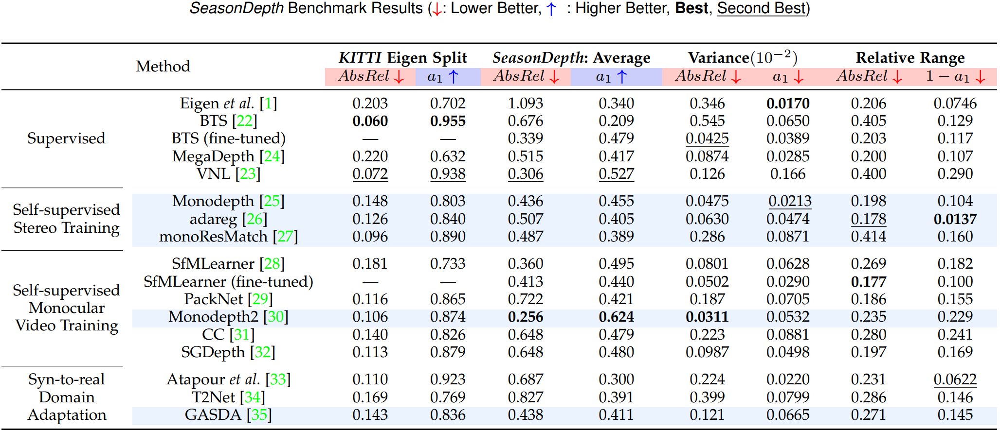

# SeasonDepth Benchmark Toolkit
This package provides a python toolkit for evaluation on the [SeasonDepth](https://seasondepth.github.io/) dataset([test set download](https://figshare.com/articles/dataset/SeasonDepth_Cross-Season_Monocular_Depth_Prediction_Dataset/14731323), [training set v1.1 download](https://figshare.com/articles/dataset/SeasonDepth_Cross-Season_Monocular_Depth_Prediction_Training_Dataset/16442025), [fine-tuned models](https://drive.google.com/file/d/12Xt_l26ZTCq2M2Oim1BfS2ltur6cX7H6/view?usp=sharing), [paper](https://arxiv.org/abs/2011.04408)). SeasonDepth is a new monocular depth prediction dataset with multi-traverse changing environments. Several representative baseline methods with recent open-source state-of-the-art models on KITTI leaderboard[[1]](#references) and fine-tuned models are evaluated on the SeasonDepth dataset.
## Quick Dataset Visualization

## Requirement
```shell script
pip install opencv-python
pip install xlwt xlrd tqdm
pip install numpy
```
## Evaluation
### 1. Dataset preparation
Download SeasonDepth dataset and create the directories below. The slices in detail can be found [here](https://data.ciirc.cvut.cz/public/projects/2020VisualLocalization/Extended-CMU-Seasons/).
```plain
└── SeasonDepth_DATASET_ROOT
    ├── depth
    │   ├── slice2
    │   │   ├──  img_00119_c0_1303398474779439us.png
    │   │   ├──  *.png
    │   ├── slice3
    │   ├── slice7
    │   └── slice8
    ├── images
    │   ├── slice2
    │   │   ├──  img_00119_c0_1303398474779439us.jpg
    │   │   ├──  *.jpg
    │   ├── slice3
    │   ├── slice7
    │   └── slice8
```
### 2. Your results preparation
Evaluate your model on SeasonDepth and organize your results as follows:
```plain
└── YOUR_RESULT_ROOT
    ├── slice2
    │   ├──  img_00119_c0_1303398474779439us.png
    │   ├──  *.png
    ├── slice3
    ├── slice7
    └── slice8
```
After that, run the evaluation script in the folder `eval_code` to find your evaluation results.
```shell
python evaluation.py --pred_pth YOUR_RESULT_ROOT --gt_pth SeasonDepth_DATASET_ROOT
```
You can also add some following arguments if you want:
```shell
--gui # To watch the results of evaluation. Press q to exit and any other key to continue.
--disp2depth # To convert disparity map to depth map for correct evaluation.
--not_clean # To generate all the intermediate xls files during evaluating.
```

### 3. Ranking method

We use the following method to evaluate rank in SeasonDepth Challenge.

```plain
final_score = 0.5 * (RANK(absrel_avg) + RANK(a1_avg)) + 0.4 * (RANK(absrel_var) + RANK(a1_var)) + 0.1 * (RANK(absrel_rng) + RANK(a1_rng))
```

Final score of a method is related to its rank of all metrics, so your total score may change before deadline.

## Evaluation Results


Qualitative comparison results with illumination or vegetation changes are shown below and more can be found in [our paper](https://arxiv.org/abs/2011.04408).


## Cite our work
Please cite the following papers if you use our dataset:
```latex
@article{SeasonDepth,
  title={SeasonDepth: Cross-Season Monocular Depth Prediction Dataset and Benchmark under Multiple Environments},
  author={Hu, Hanjiang and Yang, Baoquan and Qiao, Zhijian and Zhao, Ding and Wang, Hesheng},
  journal={arXiv preprint arXiv:2011.04408},
  year={2021}
}
```


## References
[1] A. Geiger, P. Lenz, C. Stiller, and R. Urtasun, "Vision meets robotics: The KITTI dataset," Int. J. Robot. Research (IJRR), vol. 32, no. 11, pp. 1231–1237, Sep. 2013. [http://www.cvlibs.net/datasets/kitti/](http://www.cvlibs.net/datasets/kitti/)
